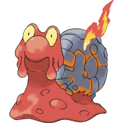

# Anime tieteen silmin

---

Varoitus: tämä luento ei sovellu kenellekään.

---

== RADICAL FREEDOM ==

# Me olemme

 <!-- .element: style="width:31.5%" -->
 <!-- .element: style="width:33.2%" -->
 <!-- .element: style="width:26%" -->

*Katiska*  
Ahti Katiska

*Magemanne*  
Niko Molin

*bps*  
Samuli Thomasson

== RADICAL FREEDOM ==

## Tieteellinen metodi

 <!-- .element: style="width:50%;float:left" -->

*Tutkii ja selittää ilmiöitä sekä niiden välisiä suhteita
järjestelmällisesti ja järkiperäisesti.*

<!-- .element: style="margin-top:15%; width:45%; float:right" -->

== CAPTAIN METAPHYSICS ==
### Tutkii ilmiöitä...
 <!-- .element: style="width:100%" -->

== CAPTAIN METAPHYSICS ==
### ...selittää ne järjestelmällisesti...

== CAPTAIN METAPHYSICS ==
### ...ja järkiperäisesti
 <!-- .element: style="width:100%" -->

== RADICAL FREEDOM ==

## Luennon kulku

- Animen fysiikka
- Animen teknologia
  - Mahdollinen
  - Mahdoton
- Animen biologia

== RADICAL FREEDOM ==
<!-- .slide: data-background="img/mikuru_come_with_me.jpg" data-background-size="auto 100%" -->

== RADICAL FREEDOM ==

### Animen fysiikka

<video controls=yes
  <source data-src="ttgl-galaxy-throw.webm" type="video/webm" />
</video>

== CAPTAIN METAPHYSICS ==

###Miten tätä voi lähestyä tieteellisesti?!

Tekemällä oletuksia tietenkin! Meidän oletuksemme olivat:

- Havaintomme ovat oikeassa
- Animen maailma on lähellä meidän maailmaamme

== CAPTAIN METAPHYSICS ==
<!-- .slide: data-background="img/migi.jpg" data-background-size="auto 100%" -->

== RADICAL FREEDOM ==
<video controls=yes>
   <source data-src="leivänpaahdin-a.webm" type="video/webm" />
</video>

== RADICAL FREEDOM ==
<video controls=yes>
   <source data-src="kageki-boobs.webm" type="video/webm" />
</video>

== RADICAL FREEDOM ==
# Tissit mainittu

 <!-- .element: class="fragment grow" -->
 <!-- .element: class="fragment grow" -->

== CAPTAIN METAPHYSICS ==
## Yliäänitissit?
### Saeko Busujima (Highschool of the Dead)

== CAPTAIN METAPHYSICS ==

== CAPTAIN METAPHYSICS ==

== CAPTAIN METAPHYSICS ==

$120$ aikayksikössä luoti näyttäisi kulkevan noin $0,5m$ matkan.
Luodin nopeus on noin $900m/s$, eli koko liikesarja tapahtuu ajassa $0.0006s$.

Huomataan, että taaemman tissin korkein kohta liikkuu noin $0.2m$ aikavälillä
$t = 30...80$. Keski*vauhdiksi* saadaan

$$\frac{0.2m}{ 50/120 * 0.0017s} = 800m/s.$$

Hetkittäinen maksiminopeus taas olisi jotain vielä suurempaa, koska kahdesti
kiihdytys pitäisi huomioida.  Äänen nopeus ilmassa on $343m/s$. 

== CAPTAIN METAPHYSICS ==
<!-- .slide: data-background="img/FA-18_going_transonic.JPG" -->

 <!-- .element: class="fragment" data-fragment-index="1" -->

*Saekon tissit todella kykenevät kulkemaan monenkertaisella äänen nopeudella.*

 <!-- .element: class="fragment" data-fragment-index="2" -->

== RADICAL FREEDOM ==

# BPS
<video controls=yes>
   <source data-src="bps-03a.webm" type="video/webm" />
</video>

== CAPTAIN METAPHYSICS ==
## Double compiling
> Analysoi hyökkääjän ohjelmaa sekä samanaikaisesti kehitti puolustusohjelman;
> rinnakkaista kehitystä, rinnakkaista kääntämistä sekä rinnakkaista
> monitorointia &mdash; kaikki samanaikaisesti puolustusohjelman ollessa ajossa.

== RADICAL FREEDOM ==

== CAPTAIN METAPHYSICS ==

- Mitä sanovat pokedexentryt
	- Magcargo's body temperature is approximately 18,000 degrees F. Water is vaporized on contact. If this Pokémon is caught in the rain, the raindrops instantly turn into steam, cloaking the area in a thick fog. 
	- The shell on its back is made of hardened magma. Tens of thousands of years spent living in volcanic craters have turned Magcargo's bodies into magma. 
	-  Its body is as hot as lava and is always billowing. Flames will occasionally burst from its shell. 

== CAPTAIN METAPHYSICS ==

	Lämpö siirtyy kolmella tavalla
		Johtumalla
		Konvektiolla
		Säteilyllä

	Triviaalisti nähdään että kannattaa tutkia säteilyä

== CAPTAIN METAPHYSICS ==

Säteilevästä kappaleesta saadaan 
	$$\frac{Q}{\nabla t}=\varepsilon\sigma A(T^4-T_0^4)$$
* $\varepsilon$ on kappaleen "mustuus".
* A on Säteilevän kappaleen pinta-ala.
* $\sigma$ on Bolzmanin vakio.
* T on Säteilevän kappaleen lämpötila.
* $T_0$ on tässä tilanteessa ulkoilman lämpötila.

== CAPTAIN METAPHYSICS ==

Oletetaan Magcargo palloksi

Magcargo on 0.79m korkea jolloin pinta-alaksi saadaan 

$r=0.79m/2=0.39m$

$A=4 \pi r^2 = 1.96m^2$

== CAPTAIN METAPHYSICS ==

Oletetaan mustuudeksi 0.5(en perustele)

18KF on noin 10255 Kelviniä

== CAPTAIN METAPHYSICS ==

Mätetään luvut kaavaan
	$$\frac{Q}{\nabla t}=(0.5)\sigma (1.96m^2)(10255K^4-313.15K^4)$$
	= $6.145*10^8$W

== CAPTAIN METAPHYSICS ==

Jee meillä on nyt pallomme teho

Kuinka paljon tuo oikeastaan on?

== CAPTAIN METAPHYSICS ==

== CAPTAIN METAPHYSICS ==

Jos Magcarco ilmestyy 10m päähän kuinka kusessa olen?

On perusteltua olettaa että lämmöneritys on pallosymmetristä.

Jos ihminen, kutsutaan häntä vaikka jarnoksi, on noin 1.8mm pitkä ja 0.5m leveä on silloin Magcargoon päin kohdistuva pinta-ala $0.9m^2$
kokonaisvaikutusalue on:
  
  $4\pi(10m)^2=1256.6 m^2$
	$$\frac{0.9m^2}{1256.6m^2}=7.16*10^{-4}$$

== CAPTAIN METAPHYSICS ==

Jarnoon siirty täten siis energiaa
 
${7.16\times10^{-4}}\times {6.145\times10^8}=4.4\times10^5$W

== CAPTAIN METAPHYSICS ==

Jarnon lämpökapasiteetti on noin $3.57 kJ kg^{-1} K^{-1}$
Jarnomme on aika laiha sovitaan että vaikka 65kg
Tällöin Jarnon lämpötila muuttuu: 

$\frac{440\frac{kj}{s}}{3.57\frac{kJ}{kg\times K}\times 65kg}=1.9\frac{K}{s}h$

== CAPTAIN METAPHYSICS ==

Miten kouluttajien naamat sitten eivät syty tuleen?
	-Jos kouluttajat ovat vetyä heidän lämpönsä nousee vain $0.47\frac{K}{s}$
	-Jos MMagcargo onkin vähemmän musta? esim jos se olisi vain 0.1 musta lämmönsiirtyvyys olisi $0.39\frac{K}{s}$
	-Jos kouluttajat ovat hirveitä läskejä ja vain näyttävät laihoilta, esim 300 kiloinen kouluttaja lämpenisi huomattavasti hitaammin
	-Kaikki yhdessä saisivat tuloksen $\frac{88\frac{kj}{s}}{14.3\frac{kJ}{kg\times K}\times 300kg}=0.02\frac{K}{s}$	

== RADICAL FREEDOM ==

Eräs tieteellinen Raidetykki, Kaasupoljin ja Maxwellin Demoni

== CAPTAIN METAPHYSICS ==

Kiskotykki alias Misaka Mikoto

== RADICAL FREEDOM ==
<!-- .slide: data-background="img/hakase_ippai.jpg" data-background-color="black" -->

# Esitys on ohi <!-- .element: style="background:rgba(0,0,0,0.3)" -->

Tekijätiimi kiittää ja kumartaa, poistuu vähin äänin takavasemmalle eikä vastaa
esityksessä esiintyneistä asiavirheistä.
   <!-- .element: style="background:rgba(0,0,0,0.3)" -->
