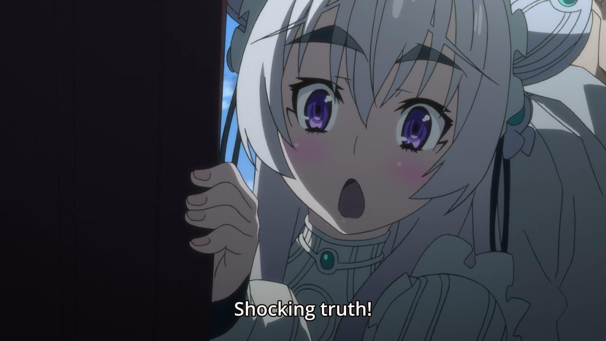

<!-- .slide: data-background="img/kurisu.jpg" -->

# Anime tieteen silmin

---

Desucon frostbite -15

---

Twitterissä: #korviavihlovattissit

== RADICAL FREEDOM ==

#Disclaimer

- Luento sisältää luonnontieteilijöille sopimatonta materiaalia
- Luennon pitäjät sisältävät spoilereita

== RADICAL FREEDOM ==

# Keitä me olemme

 <!-- .element: style="width:31.5%" -->
 <!-- .element: style="width:33.2%" -->
 <!-- .element: style="width:26%" -->

*Katiska*  
Ahti Katiska

*Magemanne*  
Niko Molin

*bps*  
Samuli Thomasson

== RADICAL FREEDOM ==

## Tieteellinen metodi

 <!-- .element: style="width:50%;float:left" -->

*Tutkii ja selittää ilmiöitä sekä niiden välisiä suhteita
järjestelmällisesti ja järkiperäisesti.*

<!-- .element: style="margin-top:15%; width:45%; float:right" -->

== CAPTAIN METAPHYSICS ==
### Tutkii ilmiöitä...
 <!-- .element: style="width:100%" -->

== CAPTAIN METAPHYSICS ==
### ...selittää ne järjestelmällisesti...

== CAPTAIN METAPHYSICS ==
### ...ja järkiperäisesti
 <!-- .element: style="width:100%" -->

== CAPTAIN METAPHYSICS ==

== RADICAL FREEDOM ==

# Luennon kulku

1. Animen fysiikka
2. Animen teknologia
3. Animen biologia

== RADICAL FREEDOM ==

# Animen fysiikka

== RADICAL FREEDOM ==

## Tengen Toppa Gurren Lagann

<video controls=yes>
  <source data-src="ttgl-galaxy-throwing.webm" type="video/webm" />
</video>

== CAPTAIN METAPHYSICS ==

### Miten tätä voi lähestyä tieteellisesti?!

Tekemällä oletuksia tietenkin! Meidän oletuksemme olivat:

- Havaintomme ovat oikeassa
- Animen maailma on lähellä meidän maailmaamme

== RADICAL FREEDOM ==

## Yurifysiikkaa

<video controls=yes>
   <source data-src="sakura-trick.webm" type="video/webm" />
</video>

*Sakura Trick #1*

== RADICAL FREEDOM ==

## Leivänpaahdin

<video controls=yes>
   <source data-src="leivänpaahdin-a.webm" type="video/webm" />
</video>

*Nichijou #5*

== CAPTAIN METAPHYSICS ==

##Kuinka voimakas leivänpaahtimen jousen pitäisi olla että näin tapahtuisi?

Tämän määrittämiseksi täytyy meidän selvittää leivän keskinopeus, alkunopeus ja loppunopeus. Näistä
voimme johtaa alkukiihtyvyyden josta saamme jousivoiman.

Tehdään aluksi tarkasteluja ja päätelmiä:

  - Leivät noin 5cm x 5cm (Tämä löytyi internetistä)
  - Japanilaiset huoneet ovat minimissään 2,1m (Tämäkin löytyi internetistä)
  - Geneerinen pöytä on 0,7 m korkea (INTERNET)

== CAPTAIN METAPHYSICS ==

Leipä lensi matkan pöydältä kattoon ajassa 3s, eli keskinopeus

$$ V_{avg} = \frac{s}{t} = \frac{2,1m - 0,7m}{3s} = 0,46 \frac{m}{s^2} $$

Kun tarkastelemme viimeisiä frameja saamme selvitettyä leipien loppunopeuden:

$$ V_{final} = \frac{s}{t} = \frac{0,075}{\frac{1}{24}s} = 1,799.. \frac{m}{s^2} $$

== CAPTAIN METAPHYSICS ==

## MUTTA MITÄ!

$$ V\_{final} > V\_{avg} $$

Tämä tarkoittaa sitä että leipiin vaikutti lennon aikana jokin muu voima painovoiman lisäksi,
tarkemmin jokin voima mikä kiihdytti leipiä kohti kattoa.

Määritelkmäämme uusi luonnon perusvuorovaikutus: Katto-Leipä-Affiniteetti, eli lyhyesti KLA. 

KLA on vakiovoima mikä määrääntyy vain leivän massasta ja universaalista Katto-Leipä-Affiniteettivakiosta,
mitä merkitään yleisesti sigmalla $\varsigma$. Eli

$$ F\_{KLA} = m_{leipä} * \varsigma $$

== CAPTAIN METAPHYSICS ==

Nyt voimme jatkaa ongelman tarkastelua kevyin sydämmin.

Alkunopeus lasketaan samaan tapaan tarkastelemalla ensimmäisiä frameja leipien lähdöstä ja sen
arvoksi saadaan:

$$ V\_{init} = 0,6\frac{m}{s^2} $$

Nyt meillä on kaikki että voimme laskea matkan aika esiintyneen keskikiihtyvyyden:

$$ a\_{avg} = \frac{V\_{final} - V\_{init}}{3s} = 0,599 \frac{m}{s^2} $$

== CAPTAIN METAPHYSICS ==

Nyt saamme newtonin toisen lain mukaan:

$$ F = ma $$

$$ F\_{KLA} - F\_g = m \* a\_{avg} $$

$$ m \* \varsigma - m \* g = m \* a\_{avg} $$

$$ \varsigma = a + g = (0,599 + 9,81) \frac{m}{s^2} $$

$$ \varsigma = 10.409 \frac{m}{s^2} $$

== CAPTAIN METAPHYSICS ==

Nyt kun tiedämme universaalin Katto-Leipä-Affiniteettikertoimen, voimme vihdoin määrittää alun
jousivakion!

Ensin lasketaan nopeasti frametutkailulla alkukiihtyvyys:

$$ a\_{init} = \frac{V\_{init} - 0}{\frac{2}{24}s} = 7,199... \frac{m}{s^2} $$

Sitten alun voimat ja kiihtyvyys mätetään newtonin kakkoseen:

$$ F\_{jousi} + F\_{KLA} - F\_g = ma\_{init} \implies kx = a + g - KLA $$

== CAPTAIN METAPHYSICS ==

Videsso nähdään että leivät uppoavat paahtimeen noin 4 cm syvyyteen, joten valitsemme x:ksi 2 cm
kuvaamaan keskimääräistä poikkeamaa:

$$ k = \frac{7,199 + 9,81 - 10,409}{0,02}\frac{N}{m} $$

$$ k = 330 \frac{N}{m} $$

== CAPTAIN METAPHYSICS ==

## Onko tämä paljon?

Jos oletamme tämän leivänpaahtimen olemassaolon meidän maailmassamme, niin
kyseinen leivänpaahdin leipiä valmistaessaan ampuisi leivät noin 20 cm
korkeuteen.

Hieman normaalia voimakkaampi leivänpaahdin.

== CAPTAIN METAPHYSICS ==

## Konkluusio

Nichijoussa ei ole mielenkiintoisia leivänpaahtimia, vaan mielenkiintoisia
luonnonvoimia.

Koska taivas on maan katto.

== RADICAL FREEDOM ==

## Voimista puheenollen

<video controls=yes>
   <source data-src="kageki-boobs.webm" type="video/webm" />
</video>

*Tantei Kageki Milky Holmes TD #1*

== RADICAL FREEDOM ==
# Tissit mainittu

 <!-- .element: class="fragment grow" -->

== CAPTAIN METAPHYSICS ==
## Yliäänitissit?
### Saeko Busujima (Highschool of the Dead)

== CAPTAIN METAPHYSICS ==

== CAPTAIN METAPHYSICS ==

== CAPTAIN METAPHYSICS ==

$120$ aikayksikössä luoti näyttäisi kulkevan noin $0,5m$ matkan.
Luodin nopeus on noin $900m/s$, eli koko liikesarja tapahtuu ajassa $0,0006s$.

Huomataan, että taaemman tissin korkein kohta liikkuu noin $0.2m$ aikavälillä
$t = 30...80$. Keski*vauhdiksi* saadaan

$$\frac{0.2m}{ 50/120 * 0,0006s} = 800m/s.$$

Hetkittäinen maksiminopeus taas olisi jotain vielä suurempaa, koska kahdesti
kiihdytys pitäisi huomioida.  Äänen nopeus ilmassa on $343m/s$. 

== CAPTAIN METAPHYSICS ==
<!-- .slide: data-background="img/FA-18_going_transonic.JPG" -->

 <!-- .element: class="fragment" data-fragment-index="1" -->

*Saekon tissit todella kykenevät kulkemaan monenkertaisella äänen nopeudella.*
 <!-- .element: class="fragment" data-fragment-index="1" -->

<audio controls>
   <source src="yliäänitissit.ogg" type="audio/ogg">
</audio>
 <!-- .element: class="fragment" data-fragment-index="1" -->

== CAPTAIN METAPHYSICS ==
<!-- .slide: data-background-transition="zoom" data-background="img/rip_them_off.jpg" data-background-size="auto 100%" -->

== RADICAL FREEDOM ==

== CAPTAIN METAPHYSICS ==

## Mitä sanovat pokedexentryt

- Magcargo's body temperature is approximately 18,000 degrees F. Water is
  vaporized on contact. If this Pokémon is caught in the rain, the raindrops
  instantly turn into steam, cloaking the area in a thick fog. 
- The shell on its back is made of hardened magma. Tens of thousands of years
  spent living in volcanic craters have turned Magcargo's bodies into magma. 
- Its body is as hot as lava and is always billowing. Flames will occasionally
  burst from its shell. 

== CAPTAIN METAPHYSICS ==

## Lämpö siirtyy kolmella tavalla

Johtumalla

Konvektiolla

Säteilyllä

Triviaalisti nähdään että kannattaa tutkia säteilyä

== CAPTAIN METAPHYSICS ==

Säteilevästä kappaleesta saadaan 

$$\frac{Q}{\nabla t}=\varepsilon\sigma A(T^4-T\_0^4) $$

- $\varepsilon$ on kappaleen "mustuus".
- A on Säteilevän kappaleen pinta-ala.
- $\sigma$ on Bolzmanin vakio.
- T on Säteilevän kappaleen lämpötila.
- $T\_0$ on tässä tilanteessa ulkoilman lämpötila.

== CAPTAIN METAPHYSICS ==

Oletetaan Magcargo palloksi

   <!-- .element: style="float:left" -->

Magcargo on 0,79m korkea jolloin pinta-alaksi saadaan 

$$r=0,79m/2=0,39m$$

$$A=4 \pi r^2 = 1,96m^2$$

== CAPTAIN METAPHYSICS ==

Oletetaan mustuudeksi 0,5 (en perustele)

18KF on noin 10255 Kelviniä

== CAPTAIN METAPHYSICS ==

Mätetään luvut kaavaan

$$ \frac{Q}{\nabla t}=(0,5)\sigma (1,96m^2)(10255K^4-313,15K^4) $$
$$ = 6,145*10^8W $$

== CAPTAIN METAPHYSICS ==

Jee meillä on nyt pallomme teho

Kuinka paljon tuo oikeastaan on?

== CAPTAIN METAPHYSICS ==

== CAPTAIN METAPHYSICS ==

### Jos Magcarco ilmestyy 10m päähän kuinka kusessa olen?

On perusteltua olettaa että lämmöneritys on pallosymmetristä.

Jos ihminen, kutsutaan häntä vaikka jarnoksi, on noin 1.8mm pitkä ja 0.5m leveä on silloin Magcargoon päin kohdistuva pinta-ala $0.9m^2$
kokonaisvaikutusalue on:
  
$$ 4\pi(10m)^2=1256,6 m^2 $$

$$ \frac{0,9m^2}{1256,6m^2}=7,16*10^{-4} $$

== CAPTAIN METAPHYSICS ==

Jarnoon siirty täten siis energiaa
 
$$ 7,16 \times 10^{-4} \times 6,145 \times 10^8 = 4,4 \times 10^5W $$

== CAPTAIN METAPHYSICS ==

Jarnon lämpökapasiteetti on noin $3,57 kJ kg^{-1} K^{-1}$.

Jarnomme on aika laiha; sovitaan vaikka 65kg.

Tällöin Jarnon lämpötila muuttuu: 

$$\frac{440\frac{kj}{s}}{3,57\frac{kJ}{kg\times K}\times 65kg}=1,9\frac{K}{s}h$$

== CAPTAIN METAPHYSICS ==

### Miten kouluttajien naamat sitten eivät syty tuleen?

- Jos kouluttajat ovat vetyä heidän lämpönsä nousee vain $0,47\frac{K}{s}$
- Jos Magcargo onkin vähemmän musta? Esim. jos se olisi vain 0.1 musta
  lämmönsiirtyvyys olisi $0,39\frac{K}{s}$
- Jos kouluttajat ovat hirveitä läskejä ja vain näyttävät laihoilta, esim
  300-kiloinen kouluttaja lämpenisi huomattavasti hitaammin
- Kaikki yhdessä saisivat tuloksen
  $$\frac{88\frac{kj}{s}}{14,3\frac{kJ}{kg\times K}\times 300kg}=0,02\frac{K}{s}$$

== RADICAL FREEDOM ==

Eräs tieteellinen Raidetykki, Kaasupoljin ja Maxwellin Demoni

== CAPTAIN METAPHYSICS ==

Kiskotykki alias Misaka Mikoto

== RADICAL FREEDOM ==

<video controls=yes>
  <source data-src="ttgl-drowning-in-space.webm" type="video/webm" />
</video>

Ja jokin animen fysiikka on täysin meidän käsityksemme ulkopuolella.

== RADICAL FREEDOM ==
<!-- .slide: data-background="img/divergence-meter.jpg" -->

# Animen teknologia

== RADICAL FREEDOM ==

## Ohjelmointi animessa
<video controls=yes>
   <source data-src="bps-03a.webm" type="video/webm" />
</video>

*Battle Programmer Shirase #1*

== CAPTAIN METAPHYSICS ==
## Double compiling
> Analysoi hyökkääjän ohjelmaa sekä samanaikaisesti kehitti puolustusohjelman;
> rinnakkaista kehitystä, rinnakkaista kääntämistä sekä rinnakkaista
> monitorointia &mdash; kaikki samanaikaisesti puolustusohjelman ollessa ajossa.

== RADICAL FREEDOM ==

## Cymatic scan psycho passissa

== CAPTAIN METAPHYSICS ==

### Tämä on mahdollista, kunhan ottaa huomioon:

Mooren lain

 <!-- .element: style="width:70%" -->

== CAPTAIN METAPHYSICS ==

### Mitä oikean maailman sibyl järjestelmän pitäisi käytännössä tehdä?

Käytännössä tunnistaa vain kuvista/videoista erinäisiä ominaisuuksia, ns "feature detection"

 <!-- .element: style="width:65%" -->

== CAPTAIN METAPHYSICS ==
<!-- use as background: data-background-video="brains.webm" data-background-video-loop="repeat" -->

### Millainen toteutus tälläiseen tarvittaisiin?

<video controls loop muted autoplay style="width:90%">
 <source data-src="brains.webm" type="video/webm" />
</video>

*Psycho-passin toteutus ei sinänsä hirveän huono!*

== RADICAL FREEDOM ==

# Animen biologia

== RADICAL FREEDOM ==

Me emme ole biologeja, mutta katsotaan silti pari esimerkkiä.

== CAPTAIN METAPHYSICS ==

## Nope.

== RADICAL FREEDOM ==
<!-- .slide: data-background="img/hakase_ippai.jpg" data-background-color="black" -->

# Esitys on ohi <!-- .element: style="background:rgba(0,0,0,0.3)" -->

Tekijätiimi kiittää ja kumartaa, poistuu vähin äänin takavasemmalle eikä vastaa
esityksessä esiintyneistä asiavirheistä.
   <!-- .element: style="background:rgba(0,0,0,0.3)" -->
